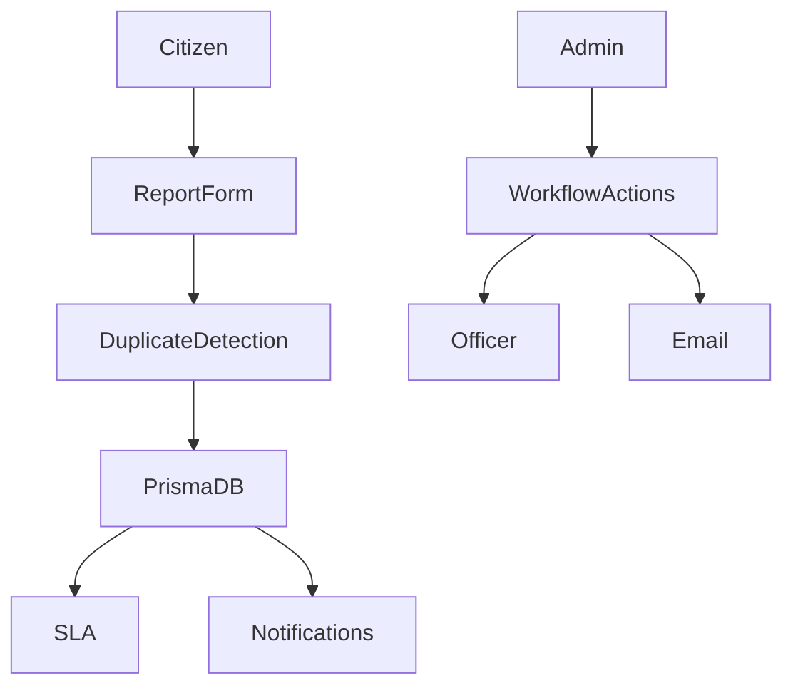

# Architecture

CivicPulse is a Next.js App Router application with server-rendered pages, Server Actions, Prisma/PostgreSQL persistence, Clerk authentication, Cloudinary evidence upload, and Resend email notifications.

## System Overview

The application is organized around a report lifecycle. Citizens create reports, admins review and update them, officers see relevant assigned/department-scoped work, and all roles receive activity updates through the notification center.

## Main Modules

- `app/citizen`: citizen dashboard, report submission, report list, and report detail pages.
- `app/admin`: admin dashboards, department CRUD, report list/detail, workflow actions, analytics, and audit log pages.
- `app/officer`: officer dashboard and officer-relevant report list/detail pages.
- `app/super-admin`: super-admin pages, with reports re-exporting the admin report implementation.
- `app/notifications`: authenticated notification center with mark-as-read actions.
- `app/api/cloudinary/signature`: authenticated route handler for signed Cloudinary uploads.
- `lib/current-user.ts`: Clerk-to-database user sync.
- `lib/prisma.ts`: shared Prisma client.
- `lib/duplicate-detection.ts` and `lib/report-duplicates.ts`: duplicate report scoring and DB-backed candidate lookup.
- `lib/sla.ts`: SLA state and display helpers.
- `lib/notifications.ts`: in-app notification helpers.
- `lib/email.ts`, `lib/email-templates.ts`, and `lib/report-email-notifications.ts`: Resend email helpers and workflow email composition.
- `lib/report-location-clusters.ts`: coordinate-based area insight clustering.

## Data Flow

1. Clerk authenticates the user.
2. `getCurrentDbUser` upserts the Clerk user into the local `User` table.
3. The relevant page or Server Action checks the user role.
4. Report data is read or written through Prisma.
5. Workflow actions create status history, audit log, notifications, and email events.
6. Pages revalidate affected report, dashboard, and notification routes.

## Role-Based Access Flow

Route protection is handled by `proxy.ts` using Clerk middleware. Protected route groups include citizen, officer, admin, super-admin, notifications, settings, and role redirect pages.

Role-specific routes are redirected to `/role-redirect` if the Clerk role metadata does not match the route group. `/role-redirect` uses the synced database user role to send users to the right dashboard.

## Report Lifecycle

The implemented report statuses are:

- `SUBMITTED`
- `VERIFIED`
- `ASSIGNED`
- `IN_PROGRESS`
- `RESOLVED`
- `REJECTED`
- `REOPENED`

Citizen submission creates a `Report`, initial `ReportStatusHistory`, `AuditLog`, optional `ReportAttachment` rows, SLA due date, and notifications.

Admin workflow actions currently support:

- Verify report.
- Assign or reassign department.
- Reject report with reason.
- Resolve assigned or in-progress report.

Each workflow action preserves audit and status history records.

## Notification Lifecycle

In-app notifications are stored in the `Notification` table and are scoped to a recipient user. Notifications can link back to the relevant report detail page for that user's role.

The notification center fetches only the current user's notifications, sorts newest first, and supports marking one or all notifications as read.

Resend email notifications are non-blocking. If email configuration is missing or Resend fails, the workflow logs a safe error and continues.

## Evidence Upload Flow

1. Citizen selects up to three image evidence files.
2. The browser requests signed Cloudinary upload parameters from `/api/cloudinary/signature`.
3. Files upload directly from the browser to Cloudinary.
4. The report Server Action receives only attachment metadata.
5. `ReportAttachment` rows store the secure URL, public ID, file name, type, and size.
6. Report detail pages render evidence through the shared evidence gallery component.

This avoids sending image binaries through Server Actions and keeps Vercel function payloads small.

## Duplicate Detection Flow

1. The report form sends title, description, category, and coordinates.
2. The server searches recent existing reports using `lib/report-duplicates.ts`.
3. Candidate reports are scored with category, distance, text similarity, and recency.
4. If likely or possible duplicates are found, the user sees a warning and can submit anyway.
5. Duplicate-warning-only submissions do not create reports or upload evidence.

## SLA Tracking Flow

SLA due date is calculated during report creation based on report priority:

- High or critical: 24 hours.
- Medium: 3 days.
- Low: 7 days.

SLA display helpers classify reports as resolved, overdue, within SLA, or not set. SLA data appears on report detail pages, list filters, summary cards, and dashboards.
